<h1 align="center"></h1>

  <a href="https://smaffan.com"></a>

  
  
  
  
  
  

I'm an AI and data engineer in Islamabad. I build voice agents that hold a real conversation, data pipelines that remember it, and computer vision that ships to production instead of staying in a notebook.

## Open them. They all still run.

  <a href="https://splendor-store.vercel.app/">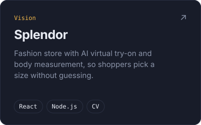</a>
  <a href="https://voice-agent-livekit.vercel.app/">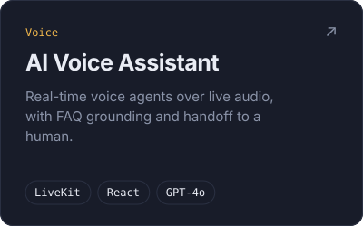</a>
  <a href="https://disaster-shield.vercel.app/">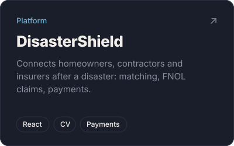</a>

  <a href="https://newslakeoriginal.vercel.app/">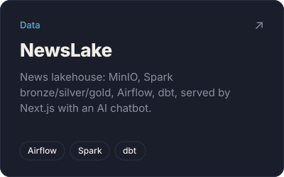</a>
  <a href="https://stories-we-tell.vercel.app/chat">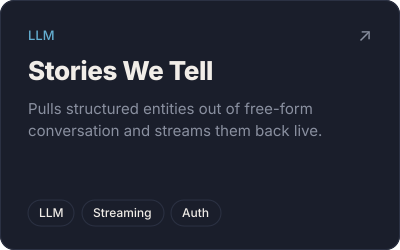</a>
  <a href="https://game.smaffan.com/">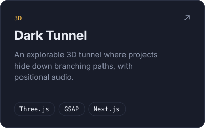</a>

  <a href="https://clipsmithstudios.vercel.app/">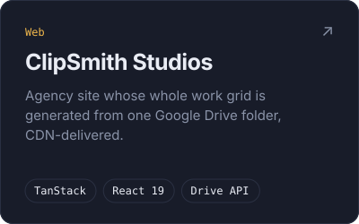</a>
  <a href="https://abdullahchughtai.vercel.app/">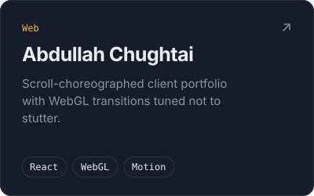</a>
  <a href="https://video.smaffan.com/">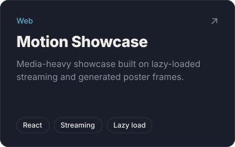</a>

## The toolkit

<b>AI / Data engineering</b> 

<b>Cloud / DevOps</b> 

<b>Databases</b> 

<b>Full-stack</b> 

## Where the hours went

**AI Engineer, Soft Techniques** (Sep 2025 to Feb 2026)
Built the Alive5 voice agent platform: LiveKit, GPT-4o and FastAPI with intent detection, FAQ grounding, Telnyx SIP telephony and call transfer, plus LiveChat and CRM integrations over Socket.io.

**Full Stack Software Engineer, VECTOR Inc.** (Feb 2025 to May 2025)
Shipped VFit virtual try-on and a computer-vision height estimation app into the Splendor store; built the frontend, Dockerized it and deployed on AWS EC2 GPU instances.

**Front-end Development Intern, Moqah.pk** (Nov 2024 to Jan 2025)
Auth flows, event carousels, policy and event-detail pages, and backend bug fixes.

## Writing

- [Knative: A Complete Approach towards Serverless Kubernetes](https://medium.com/@affan4321/knative-a-complete-approach-towards-serverless-kubernetes-88e520b3da81)
- [Deep Dive: Dockerizing WASM based GenAI Applications](https://medium.com/@affan4321/deep-dive-dockerizing-wasm-based-gen-ai-applications-a39363b1a8e0)

## Activity

  
  

  

  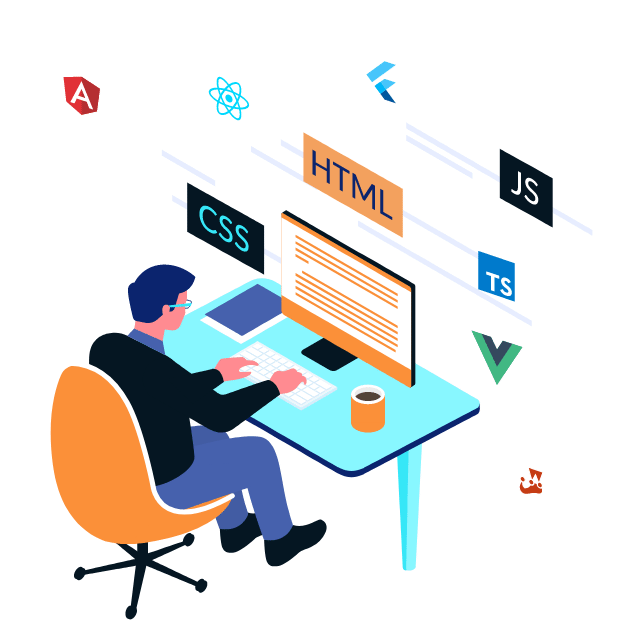

  <a href="mailto:affan4321@gmail.com">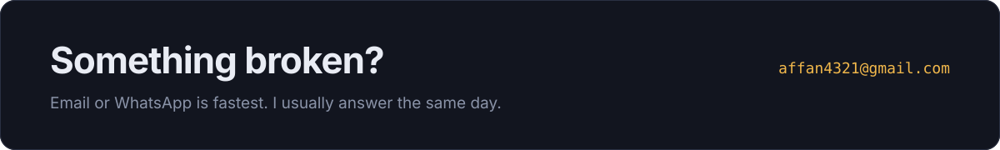</a>

  

